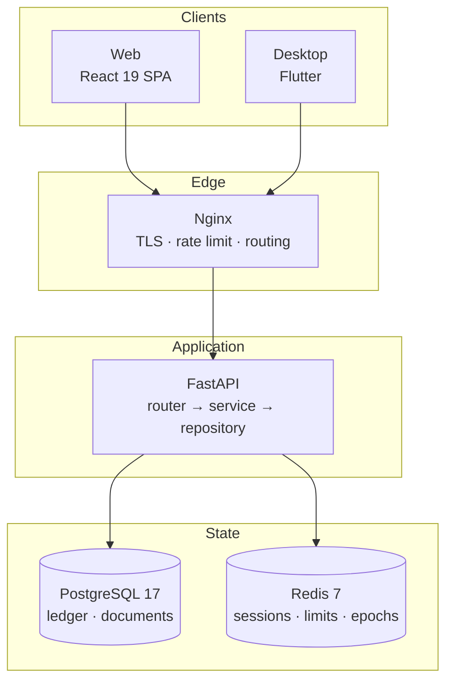

<div align="center">

# Personal ERP

**A self-hosted ERP for small businesses. Simple to run, yours to keep.**

[](https://github.com/Madhur-Prakash/Personal-ERP/actions/workflows/ci.yml)


[Documentation](docs/README.md) · [Quick start](#quick-start) · [Architecture](docs/architecture.md) · [Security](docs/security.md) · [Deployment](docs/deployment.md)

</div>

---

## Why it exists

Small businesses are offered two bad options. This is the third.

| Option | What it costs you |
| --- | --- |
| Cloud SaaS | Rents you your own books, and raises the price once you depend on it |
| Legacy desktop software | Lives on one machine and dies with its hard drive |
| **Personal ERP** | **Runs on your server, data in your PostgreSQL, no vendor in between** |

The design constraint is **restraint**:

- **Not an enterprise platform.** No Kubernetes, no message-broker cluster, no service mesh.
- **One `docker compose up`**, operable by one person with no DevOps team.
- **Modular, so it can grow.** More workers, a read replica, a separate object store - each swaps out without rewriting the rest.
- **Scale when the business demands it**, not on day one.

> Built in stages. **Stages 1-5 and 8 are complete** - see [Delivery status](#delivery-status).

---

## What exists today

<table>
<tr><th align="left">Area</th><th align="left">Capability</th></tr>

<tr><td><b>Platform</b></td><td>

- Monorepo with Docker Compose for development and production
- FastAPI backend · PostgreSQL 17 · Redis 7
- React 19 + TypeScript + Vite web client
- Flutter desktop client for Windows, macOS and Linux - same screens, same API, stays signed in across restarts
- Alembic migrations: reversible and drift-checked
- CI, Nginx, TLS, backups, zero-downtime deploy

</td></tr>

<tr><td><b>Identity</b></td><td>

- Password, email verification, magic link (signs the desktop app in too), email OTP, password reset by emailed code
- TOTP two-factor with recovery codes
- Refresh-token rotation with reuse detection, device history, remote revocation
- Organizations, members, invitations
- RBAC: 42 permissions, 5 seeded roles, custom roles, per-member overrides
- Immutable audit trail with field-level diffs

</td></tr>

<tr><td><b>Money</b></td><td>

- **Billing** - record money in and out with a date, an amount and a note. No customer or supplier required; posts real double-entry
- **Accounts & cards** - bank accounts with bank, holder and account number (encrypted; **no card PAN is stored at all**), cards registered from their number, transfers between your own accounts
- Double-entry accounting - chart of accounts, journals, period locks, trial balance, P&L, balance sheet, cash flow

</td></tr>

<tr><td><b>Trade</b></td><td>

- Sales - customers, leads, quotations, orders, GST invoices, payment allocation, receivables ageing
- Purchasing & inventory - suppliers, POs, goods receipt, weighted-average valuation, bills, input GST, payables ageing
- Document intelligence - invoice upload, field extraction with per-field confidence, GSTIN supplier matching, duplicate warnings, confirm-into-bill

</td></tr>

<tr><td><b>Insight</b></td><td>

- Analytics - real dashboard figures, like-for-like period comparison, twelve-month trend, rankings
- Control-account reconciliation - receivables, payables and stock derived twice and compared
- Design system, light/dark/system theming, command palette

</td></tr>
</table>

> **There is no OAuth.** Sign-in is email/password plus the passwordless options above, by design.

---

## Quick start

**Requires** Docker, plus [uv](https://docs.astral.sh/uv/) and Node 24 for running outside containers.

```bash
git clone https://github.com/Madhur-Prakash/Personal-ERP && cd Personal-ERP
make setup          # creates .env, installs deps, starts services, migrates
make up             # starts the whole stack
```

| Service | Address |
| --- | --- |
| Frontend | <http://localhost:5173> |
| API | <http://localhost:8000> |
| API reference | <http://localhost:8000/docs> |
| Desktop client | `make desktop` - a native window, not a URL |

Register at <http://localhost:5173/register>. `make help` lists every task.

> **Getting the verification email.** Mail goes through the Gmail API and nothing else, so
> delivery depends on whether `GMAIL_CREDENTIALS_B64` is set - see
> [Email in development](docs/development.md#email-in-development). With no credentials,
> emails are written to the log instead; logifyx masks `token=...` out of the URL, so set
> `LOG_MASK=false` to make the link usable locally.

---

## The simple path: just record money

Most small businesses do not need invoices, customers or suppliers. They need to note what
came in and what went out. **Billing** is that screen, and it is first in the navigation.

- **Three buttons** - *Money in*, *Money out*, *Transfer*
- **Type an amount and a note.** Date defaults to today; category and cash account default sensibly; the form stays open so a week of receipts goes in one sitting
- **Nothing else is required** - no customer, no supplier, no invoice
- **Choose where it landed** - a cash box, any bank account, or a card. Add an account or register a card without leaving the screen

### Why a nameless bill is an expense, not a payable

- A payable exists because you owe **a specific party**
- Once the money has left your hand, there is nothing owed and nobody to owe it to
- So the postings are simply:

| Action | Debit | Credit |
| --- | --- | --- |
| Money out | Expense | Cash |
| Money in | Cash | Income |
| Transfer | Destination account | Source account |

- Every entry is a **real ledger posting**, so it reaches the trial balance, P&L, cash flow, dashboard and analytics with nothing else configured
- **There is no billing table.** A parallel store of "the user's simple view" would be a cache that can disagree with the ledger
- **To correct a mistake, reverse the entry.** No delete, no edit - a posted entry is immutable, and the honest undo is an opposite entry that nets it to zero. The original stays on the record

### Accounts and cards

Its own entry in the sidebar on web and desktop: every bank account, cash box and card in
one list, editable in place. The same panel sits at the foot of Billing.

Four decisions worth stating outright, because each is easy - and expensive - to get wrong:

| Decision | Why |
| --- | --- |
| **No card number is ever stored** | Adding a card checks the Luhn digit, derives the scheme and last four, and throws the rest away. There is no PAN column and no field to return one - a test queries `information_schema.columns` to keep it that way. Storing one would put the whole database in PCI DSS scope, and last-four is what receipts and statements print anyway |
| **Bank account numbers are stored in full, encrypted** | You must quote one to be paid, print it on an invoice and match it to a statement. Encrypted at rest with the same key material as a 2FA secret; lists show last four; one route behind `account:read` returns the whole thing |
| **A credit card is a liability, not a place you have money** | It creates an account under Current Liabilities, so spending increases what you owe rather than reducing what you hold. A *debit* card gets no account at all - it is a way of using a bank account you already have, and a second account would double-count |
| **A transfer is neither income nor expense** | Moving your own money - including paying off a card - has no category and stays out of the money-in/money-out totals. Counting it would show income that never arrived from anywhere |

> Customers, GST invoices, suppliers and scanned-document capture all still exist for when
> they are genuinely needed. Nothing forces you through them.

---

## Optional: reading scanned invoices

Document upload works without this - the file is stored and can be attached to a bill
entered by hand. The extra adds *reading* it.

```bash
cd backend && uv sync --extra ocr
```

- **Digital PDFs work immediately.** `pypdf` reads the text layer, which is exact and needs nothing installed
- **Images need the Tesseract binary**, a system package `pip` cannot install:

| Platform | Install |
| --- | --- |
| Windows | [UB-Mannheim installer](https://github.com/UB-Mannheim/tesseract/wiki) |
| Debian / Ubuntu | `apt install tesseract-ocr` |
| macOS | `brew install tesseract` |
| Docker | Already in the image - [`backend/Dockerfile`](backend/Dockerfile) installs it |

- **`TESSERACT_CMD` is a host path.** The Windows installer does not add itself to `PATH`; both compose files override the value with `/usr/bin/tesseract` for the container, since `env_file` would otherwise hand a Windows path to a Linux image
- **`OCR_LANGUAGES` needs matching packs.** `eng+hin` requires `tesseract-ocr-hin` on the `apt-get` line, or recognition fails rather than degrades
- **`GET /api/v1/documents/capabilities`** reports what the server can actually read, and the Documents screen says so plainly instead of offering an upload button that fails
- **The heavyweight engines are deliberately absent.** PaddleOCR pulls PaddlePaddle (~500 MB) and EasyOCR pulls torch (~2 GB), against "one person can run this on a small VPS". Tesseract is ~30 MB and reads a GST invoice well

---

## Architecture



**Dependencies point inward** - `router → service → repository → models`:

| Layer | Knows about | Never touches |
| --- | --- | --- |
| `router.py` | FastAPI, HTTP | Business rules |
| `service.py` | Business rules, domain errors | HTTP, requests |
| `repository.py` | The database session | Business rules |
| `models.py` | Tables and columns | Everything above |

- A service never imports a router; a repository never raises HTTP errors
- That is what makes modules **independently testable and replaceable**
- Full detail in [docs/architecture.md](docs/architecture.md)

### Project layout

```
.
├── backend/                 FastAPI · Python 3.13 · uv
│   ├── app/
│   │   ├── core/            Config, logging, security, errors, middleware
│   │   ├── db/              Declarative base, mixins, session, model registry
│   │   ├── modules/         One vertical slice per bounded context
│   │   └── api/v1/          Router aggregation
│   ├── migrations/          Alembic
│   └── tests/               pytest - 714 tests
├── frontend/                React 19 · TypeScript · Vite · Tailwind v4
│   └── src/
│       ├── components/      Design-system primitives and layout
│       ├── features/        auth, dashboard, organizations, settings, theme
│       ├── lib/             HTTP client, env validation, formatting
│       └── routes/          TanStack Router tree
├── app_frontend/            Flutter desktop client · Windows · macOS · Linux
│   └── lib/
│       ├── theme/           The web app's oklch tokens, converted at runtime
│       ├── widgets/         The same design system, rendered natively
│       ├── features/        One directory per screen, mirroring frontend/src/features
│       └── core/            Env, HTTP client with a cookie jar, exact-decimal money
├── installer/               Inno Setup script for the Windows desktop build
├── infra/
│   ├── nginx/               Edge reverse proxy, TLS, rate limiting
│   └── scripts/             Backup and restore
├── docs/                    Nine documents - start at docs/README.md
└── .github/workflows/       CI
```

Every backend module is the same vertical slice:

```
modules/<name>/
  models.py        SQLAlchemy tables
  schemas.py       Pydantic request/response contracts
  repository.py    Data access - the only layer touching the session
  service.py       Business rules - transport-agnostic
  router.py        HTTP surface - thin
```

---

## Design decisions worth knowing

Each is explained where it lives, in the code.

| Decision | Rationale | Source |
| --- | --- | --- |
| **Access tokens in memory; refresh tokens in an HttpOnly cookie** | `localStorage` is readable by any XSS, and a stolen token is valid until it expires. The short-lived token dies with the tab; the long-lived one is never reachable from JavaScript | [`lib/api.ts`](frontend/src/lib/api.ts) |
| **Refresh tokens rotate; reuse is treated as a breach** | Presenting an already-rotated token means two parties hold it and we cannot tell which is legitimate - so the whole lineage is revoked and audited as critical | [`auth/service.py`](backend/app/modules/auth/service.py) |
| **Permissions ride in the token; a Redis epoch overrides it** | Authorization costs no database query. Staleness is bounded by the 15-minute TTL, and anything that must apply at once - role change, suspension, sign-out-everywhere - bumps the epoch | [`auth/dependencies.py`](backend/app/modules/auth/dependencies.py) |
| **The active organization comes from the signed token, never the URL** | No organization id in any path for a client to tamper with, making cross-tenant access structurally impossible rather than merely checked | [`organizations/router.py`](backend/app/modules/organizations/router.py) |
| **Permissions are code; roles are data** | A permission is a capability the software implements, so the enum *is* the contract - greppable, and unable to drift from a table. Roles are per-organization rows composing those slugs | [`rbac/permissions.py`](backend/app/modules/rbac/permissions.py) |
| **No account enumeration** | Reset, magic link and OTP answer identically whether or not the account exists, and login burns an Argon2 cycle on a miss so timing cannot distinguish them either | [`auth/service.py`](backend/app/modules/auth/service.py) |
| **Password policy with a blocklist backstop** | Composition rules reliably produce `Password@1`. A blocklist rejects weak roots however they are dressed up - `P@ssw0rd` and `Passw0rd!` both normalise to `password` | [`auth/password_policy.py`](backend/app/modules/auth/password_policy.py) |
| **UUIDv7 primary keys** | Time-ordered, so inserts append to the right edge of the index instead of scattering, and cursor pagination is a primary-key seek with no composite cursor | [`db/base.py`](backend/app/db/base.py) |
| **The audit trail is append-only** | No `updated_at`, no soft delete, no update path in the repository. An audit log that can be edited is not evidence | [docs/security.md](docs/security.md) |
| **All logging goes through logifyx** | One entry point, with automatic redaction of passwords and tokens, request-scoped context, and JSON output in production | [`core/logging.py`](backend/app/core/logging.py) |

---

## The stack

| Layer | Technologies |
| --- | --- |
| **Backend** | FastAPI · Python 3.13 · uv · SQLAlchemy 2 (async) · Alembic · PostgreSQL 17 · Redis 7 · Pydantic v2 · Argon2id · PyJWT · pyotp · httpx · [logifyx](https://pypi.org/project/logifyx/) |
| **Frontend** | React 19 · TypeScript · Vite 7 · Tailwind CSS v4 · TanStack Router/Query/Table · React Hook Form · Zod · Recharts · cmdk · Sonner · Lucide · Motion |
| **Desktop** | Flutter 3.44 · Dart 3.12 · Material 3 · Riverpod · go_router · Dio with a persisted cookie jar · fl_chart · Lucide |
| **Infrastructure** | Docker · Nginx · Let's Encrypt · GitHub Actions · Inno Setup |

> The desktop client uses the same API and the same design tokens - see
> [app_frontend/README.md](app_frontend/README.md) for the four places a native window
> honestly differs from a browser.

---

## Everyday commands

Backend commands run from `backend/`, frontend commands from `frontend/`.

### Quality gates

All are blocking in CI, so run them before pushing.

| Backend | Frontend | Purpose |
| --- | --- | --- |
| `uv run ruff check app tests` | `npm run lint` | Find problems |
| `uv run ruff format .` | `npm run format` | Fix formatting |
| `uv run mypy app` | `npm run typecheck` | Typecheck |
| `uv run pytest` | `npm run build` | Prove it works |

- **[ruff](https://docs.astral.sh/ruff/)** is linter and formatter in one, well under a second across the backend. Beyond style it enforces two things that matter here: `T20` bans `print()` so logging cannot bypass logifyx and lose its masking, and `ASYNC` catches blocking calls inside `async def` that would stall the event loop rather than one request
- **[mypy](https://mypy-lang.org/)** runs `strict`. Its real job is making `None` impossible to ignore - `User.password_hash` is nullable for magic-link and invited users, and mypy forces every call site to handle that before reaching Argon2
- CI runs `ruff check .` and `ruff format --check .` (the non-mutating form) across the whole project; narrowing to `app tests` locally is faster and covers what you edit

### Tests, migrations, servers

```bash
uv run pytest                                      # 714 tests, needs postgres + redis
uv run pytest -q -k auth                           # just the auth suite
uv run pytest --cov                                # with coverage

uv run alembic upgrade head                        # apply
uv run alembic revision --autogenerate -m "msg"    # generate
uv run alembic downgrade -1                        # roll back one

uv run uvicorn app.main:app --reload               # backend  → :8000
npm run dev                                        # frontend → :5173
make desktop                                       # desktop client → native window
```

> **On Windows, run raw commands from PowerShell, not Git Bash.** MSYS rewrites
> environment values that look like Unix paths, so `API_V1_PREFIX=/api/v1` reaches Python
> as `C:/Program Files/Git/api/v1` and the app dies at import. **`make` targets are safe
> from either shell** - the [Makefile](Makefile) resolves Git Bash explicitly and sets
> `MSYS2_ENV_CONV_EXCL=*` to switch that translation off.

---

## Verified state

Everything below was run against real infrastructure, not mocks.

| Component | Result |
| --- | --- |
| Backend tests | 714 passing against PostgreSQL 17 + Redis 7 |
| Backend lint | ruff: all checks passed |
| Migrations | Apply, reverse, and report zero drift |
| Frontend types | `tsc -b`: 0 errors |
| Frontend lint | eslint: 0 problems, type-aware rules enabled |
| Frontend build | `vite build` succeeds, 0 vulnerabilities in the dependency tree |
| Desktop analysis | `flutter analyze`: 0 issues |
| Desktop tests | 42 passing, including a live session round-trip against the API |
| Desktop release | Windows binary builds, starts, and restores its session across three consecutive relaunches with no token reuse detected |
| Compose | Dev and prod files validate |
| Images | Both production images build, run non-root, and pass health checks |
| Live journey | register → verify → login → refresh rotation → reuse detection → lineage revocation → critical audit row |

Coverage focuses where a bug is expensive: token rotation and reuse detection, permission
expansion, cross-tenant isolation, owner-lockout prevention, and secret redaction.

---

## Documentation

**[docs/](docs/README.md)** is the index - reading paths by task, and a map of how the nine
documents relate. Every page carries a nav bar to every other.

| Document | Contents |
| --- | --- |
| [Specification](docs/spec.md) | Product goals, modules, delivery model, non-negotiables |
| [Architecture](docs/architecture.md) | Layering, request lifecycle, module structure, diagrams |
| [Database](docs/database.md) | Schema, ER diagram, indexes, migration workflow |
| [Accounting](docs/accounting.md) | Double-entry invariants, exact money, reversals, numbering, fiscal calendar |
| [API](docs/api.md) | Auth flows, error contract, pagination, endpoints |
| [Security](docs/security.md) | Threat model and every control, with rationale |
| [Security audit](docs/security-audit.md) | Nine findings against running code, each with its fix and how to verify it |
| [Development](docs/development.md) | Local workflow, conventions, testing, adding a module |
| [Deployment](docs/deployment.md) | VPS setup, TLS, backups, zero-downtime deploys |

**Elsewhere:** [`app_frontend/README.md`](app_frontend/README.md) for the desktop client ·
[`installer/README.md`](installer/README.md) for packaging the Windows build ·
`/docs` on a running server for the generated OpenAPI reference.

---

## Delivery status

**Parallel build-out** - modules are developed concurrently rather than gated on the
previous one signing off. The quality bar is unchanged: strict mypy, real tests against
real PostgreSQL and Redis, a documented rationale per module. A module ships when *it* is
green, not when its predecessor is.

The one thing that stays sequenced is the **dependency graph**, because it is arithmetic
rather than process: sales and inventory post into the ledger, so the ledger's posting
contract must exist first. That contract is
[`PostingService.post_simple`](backend/app/modules/accounting/service.py) and it is stable.

| Stage | Scope | Status |
| --- | --- | --- |
| **1 · Foundation** | Monorepo, Docker, auth, users/organizations, RBAC, audit, CI, design system, dashboard, deployment | Complete |
| **2 · Accounting core** | Chart of accounts, journals, ledgers, double-entry, trial balance, P&L, balance sheet, cash flow. Entries immutable and corrected only by reversal; periods lock; numbering gap-free under concurrency | Complete |
| **3 · Customers & sales** | CRM, leads, quotations, orders, invoices, payments. Real double-entry, GST split CGST/SGST vs IGST by place of supply, many-to-many payment allocation | Complete · *PDF generation pending* |
| **4 · Purchases & inventory** | Suppliers, POs, goods receipt, warehouses, stock movements, barcodes. Weighted-average valuation reconciling exactly to the Inventory account, GRNI accrual, input GST, COGS on sale | Complete |
| **5 · Document intelligence** | GSTIN, invoice number, date and amounts read with per-field confidence; supplier matched by GSTIN; duplicates flagged. **OCR never posts to the ledger** - it pre-fills a form, and confirming goes through the same `BillService` as a hand-entered bill | Complete |
| **6 · AI assistant** | Conversational interface, RAG over business data, natural-language queries, forecasting | Planned |
| **7 · Automation platform** | Visual workflow builder, triggers, scheduled jobs, approval flows, messaging integrations | Planned |
| **8 · Analytics & reporting** | Revenue, expenses, profit, cash, receivables, payables and stock, each with like-for-like comparison, plus twelve-month trend and rankings. Every figure computed by the same `ReportingService` that renders the P&L. Ships control-account reconciliation | Complete · *custom report builder pending* |
| **9 · Enterprise** | Advanced multi-tenancy, API keys, webhooks, SSO, compliance, passkeys | Planned |
| **10 · Production hardening** | Security review, monitoring, load testing, performance tuning | Planned |

Modules not yet built appear in the navigation as visibly disabled entries rather than
links to nothing.

### A note on the dashboard

Earlier revisions of this README warned that revenue, expense and profit figures were
illustrative placeholders labelled "Sample". **They are not any more** - as of Stage 8
every figure derives from posted ledger entries, and the fabricated series was deleted
rather than left behind a flag.

Two rules it follows, both about not overclaiming:

- **A month-to-date figure is compared against the same number of days**, not the whole previous month. On the 3rd, the naive comparison reports revenue "down 90%" - misleading for most of every month
- **A percentage change with no basis is not shown as a number.** ₹0 to ₹50,000 is not "+100%", it is undefined, so the tile says "no prior data"

If the ledger ever disagrees with the documents behind it, the dashboard leads with that
rather than quietly rendering figures derived from a broken ledger.

---

## Licence

Proprietary. All rights reserved.
