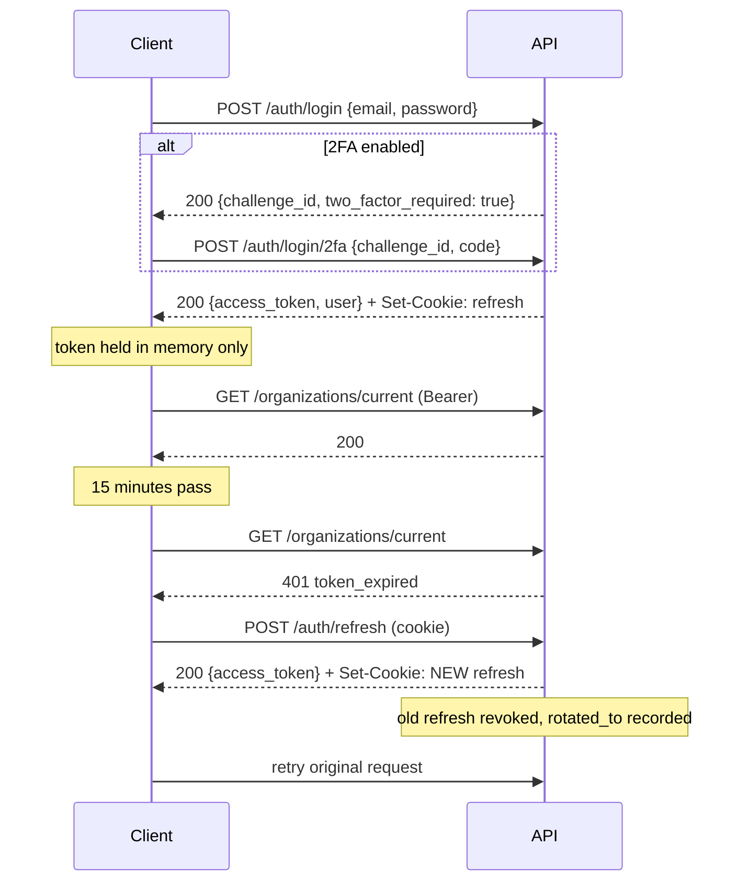

# API

Base: `/api/v1`. Interactive docs at `/docs` (development only — disabled in
production, and blocked at the edge as well).

All bodies are `snake_case`, matching the database and the frontend types. One
name per field, everywhere.

---

## Authenticating

```
Authorization: Bearer <access_token>
```

Access tokens last 15 minutes. Refresh tokens arrive as an
`HttpOnly; Secure; SameSite=Strict` cookie scoped to `/api/v1/auth` and are
rotated on every use.

### The flow



The client's refresh is **single-flight**: when a token expires, every in-flight
request 401s at once, and independent refreshes would present the same
already-rotated token — which the server correctly treats as a breach and responds
to by revoking the session. See [`lib/api.ts`](../frontend/src/lib/api.ts).

---

## Error contract

Every failure, from every endpoint:

```json
{
  "error": {
    "code": "permission_denied",
    "message": "You do not have permission to perform this action",
    "details": { "required_permission": "invoice:approve" },
    "request_id": "01930f4c-8a2b-7c1d-9e3f-4a5b6c7d8e9f"
  }
}
```

Branch on `code`, never on `message`.

| Status | Meaning |
| --- | --- |
| 400 | Malformed request |
| 401 | Not authenticated, token invalid/expired, or 2FA required |
| 403 | Authenticated but not permitted; or email unverified; or account disabled |
| 404 | Not found — also returned for another tenant's resources |
| 409 | Conflict (duplicate email, pending invitation, slug taken) |
| 422 | Validation failure, or a business-rule violation |
| 423 | Account temporarily locked |
| 429 | Rate limited — see `Retry-After` |
| 503 | A dependency is unavailable |

### Notable codes

| Code | Status | Meaning |
| --- | --- | --- |
| `invalid_credentials` | 401 | Wrong email *or* password — deliberately indistinguishable |
| `two_factor_required` | 401 | Password accepted; submit a code. `details.challenge_id` |
| `email_not_verified` | 403 | Recoverable — offer to resend |
| `account_locked` | 423 | `details.retry_after_seconds` |
| `email_taken` | 409 | Registration only |
| `cannot_remove_owner` | 422 | Transfer ownership first |
| `role_in_use` | 422 | `details.member_count` |
| `no_active_organization` | 403 | Create or join one |

A 422 from Pydantic carries `details.fields` as `{field: message}`, ready to hand
to a form library. A password-policy failure carries `details.password` as a list
of reasons.

---

## Endpoints

47 in total.

### Authentication — `/auth`

| Method | Path | Auth | Notes |
| --- | --- | --- | --- |
| POST | `/register` | — | Optional `organization_name` or `invitation_token`, never both |
| POST | `/verify-email` | — | Single-use token |
| POST | `/resend-verification` | — | Neutral response |
| POST | `/login` | — | Returns tokens **or** a 2FA challenge |
| POST | `/login/2fa` | — | Accepts a TOTP or a recovery code |
| POST | `/refresh` | cookie | Rotates. Body fallback for non-browser clients |
| POST | `/logout` | Bearer | `{all_devices: true}` revokes everything |
| GET | `/me` | Bearer | Full principal: orgs, active org, permissions |
| GET | `/password-policy` | — | The enforced policy |
| POST | `/forgot-password` | — | Neutral response |
| POST | `/reset-password` | — | Revokes all sessions |
| POST | `/change-password` | Bearer | Requires the current password; revokes all sessions |
| POST | `/magic-link` | — | Neutral response |
| POST | `/magic-link/verify` | — | Single-use |
| POST | `/otp` | — | Neutral response |
| POST | `/otp/verify` | — | 5 attempts, then the code is destroyed |
| POST | `/2fa/setup` | Bearer | Returns secret, URI, QR data URI |
| POST | `/2fa/enable` | Bearer | Requires a valid code; returns 10 recovery codes **once** |
| POST | `/2fa/disable` | Bearer | Requires the password |
| POST | `/2fa/recovery-codes` | Bearer | Requires the password; invalidates the old set |
| GET | `/sessions` | Bearer | Device history, current flagged |
| DELETE | `/sessions/{id}` | Bearer | Own sessions only |
| POST | `/switch-organization/{id}` | Bearer | Re-mints the token |
| GET | `/permissions` | Bearer | Resolved live from the database |

### Users — `/users`

| Method | Path | Notes |
| --- | --- | --- |
| GET | `/me` | Own profile |
| PATCH | `/me` | Partial. Cannot change email, `is_active`, or `is_superuser` |
| PATCH | `/me/preferences` | Theme, locale, timezone |
| GET | `/me/stats` | Sessions, organizations, recovery codes remaining |

### Organizations — `/organizations`

Note the absence of an id in these paths. The active organization comes from the
signed token, which is what makes cross-tenant access impossible rather than
merely checked.

| Method | Path | Permission |
| --- | --- | --- |
| GET | `/` | — (own memberships) |
| POST | `/` | verified email |
| GET | `/current` | `organization:read` |
| PATCH | `/current` | `organization:update` |
| DELETE | `/current` | `organization:delete` (owner only; soft delete) |
| POST | `/current/leave` | — (not the owner) |
| GET | `/current/members` | `member:read` |
| PATCH | `/current/members/{id}` | `member:update` |
| POST | `/current/members/{id}/suspend` | `member:update` |
| POST | `/current/members/{id}/reactivate` | `member:update` |
| DELETE | `/current/members/{id}` | `member:remove` |
| GET | `/current/invitations` | `member:read` |
| POST | `/current/invitations` | `member:invite` |
| POST | `/current/invitations/{id}/resend` | `member:invite` |
| DELETE | `/current/invitations/{id}` | `member:invite` |

### Invitations — `/invitations`

| Method | Path | Auth | Notes |
| --- | --- | --- | --- |
| GET | `/{token}` | — | Preview. Deliberately minimal — anyone with the link sees this |
| POST | `/accept` | Bearer | For an existing account; new users register with the token |

### Roles — `/roles`

| Method | Path | Permission |
| --- | --- | --- |
| GET | `/permissions` | `role:read` — the full catalogue, grouped |
| GET | `/` | `role:read` |
| POST | `/` | `role:create` |
| GET | `/{id}` | `role:read` — stored grants **and** their expansion |
| PATCH | `/{id}` | `role:update` |
| DELETE | `/{id}` | `role:delete` |

### Audit — `/audit`

| Method | Path | Permission |
| --- | --- | --- |
| GET | `/` | `audit:read` — cursor-paginated, filterable |
| GET | `/actions` | `audit:read` — the action vocabulary |

### Health — `/health` (unversioned, public)

| Path | Purpose |
| --- | --- |
| `/health/live` | Liveness. **Touches no dependency** — a database blip must not make the orchestrator kill healthy containers |
| `/health/ready` | Readiness. Probes PostgreSQL and Redis concurrently; 503 when either is down |
| `/health` | Human-readable summary |

---

## Pagination

**Cursor** for the audit trail:

```
GET /audit?limit=25&cursor=<opaque>
→ { "items": [...], "next_cursor": "...", "has_more": true }
```

Constant cost at any depth and stable under concurrent inserts. The trail is
append-heavy, where `OFFSET` both degrades with depth and shifts rows under the
reader as new events arrive. UUIDv7 keys make the cursor a primary-key seek.

A malformed cursor degrades to the first page rather than 400 — cursors are opaque
to clients, so an error there is unactionable, and callers commonly truncate them
in URLs.

**Offset** is available (`Page[T]`) for data tables that need "jump to page 7".

---

## Rate limits

Two layers. Both send `X-RateLimit-Limit`, `X-RateLimit-Remaining`,
`X-RateLimit-Reset`, and `Retry-After` on rejection.

| Scope | App | Edge (Nginx) |
| --- | --- | --- |
| Default | 200/min per IP | 30 r/s, burst 100 |
| Auth paths | 10/min per IP | 2 r/s, burst 8 |
| `/health/*` | exempt | exempt |

Separately, per-account lockout after 5 failed logins — keyed on the email, since
an attacker rotates IPs trivially.

---

## Conventions

- **Timestamps** are ISO 8601 UTC with offset: `2026-07-26T14:30:00Z`.
- **Ids** are UUIDv7 strings.
- **`X-Request-ID`** is echoed on every response and appears in the error
  envelope. An inbound value is honoured, so a trace survives a proxy hop.
- **CORS** requires explicit origins — a wildcard is rejected at boot, because
  browsers forbid `*` alongside credentials, and the refresh cookie needs them.
- **No trailing-slash redirects.** A 307 on a POST turns it into a GET and drops
  the body in some clients, so a wrong URL 404s instead.
